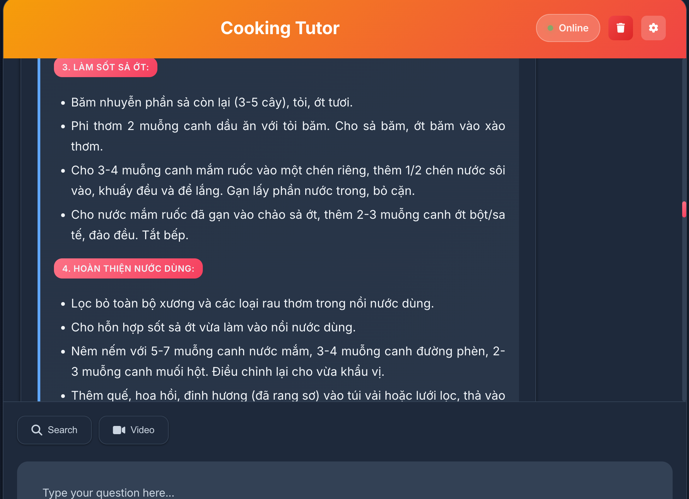

# Cooking Tutor Platform

Welcome to the AI-powered Cooking Tutor project! This platform leverages cutting-edge technologies such as Retrieval-Augmented Generation (RAG), Gemini Flash 2.5, and comprehensive web search to deliver an intelligent cooking assistant. It provides step-by-step cooking guidance, recipe suggestions, and culinary expertise with proper source citations.

## Access Now
- [Web App](https://cooking-tutor.vercel.app/)
- [API Documentation](https://binkhoale1812-cooking-tutor.hf.space/docs)

  

## 🍳 Frontend Capabilities
- Multilingual UX (EN/VI/ZH) with responsive design
- Interactive chat interface with cooking guidance
- Web-augmented answers with source citations
- Inline markdown rendering for recipes and instructions
- Source transparency with clickable citation links
- Mobile-first design with accessibility features

## 🔧 Backend Capabilities
- **Web Search Integration**: Comprehensive cooking information from curated sources
- **Memory Management**: Conversation continuity with semantic chunking
- **Multilingual Support**: Vietnamese and Chinese translation
- **Citation System**: Proper source attribution with URL mapping
- **Cooking Focus**: Specialized filtering for culinary content
- **Safety Checks**: Cooking relevance validation

## 🧠 Technical Highlights
- FastAPI modular services (api, models, memory, search, utils)
- FAISS vector retrieval for memory management
- Gemini 2.5 Flash for intelligent responses
- Web search with content extraction and summarization
- Robust logging and error handling

## 📊 Memory & Retrieval
- Per-user conversation memory with FAISS indexing
- Topic-level chunking and summarization
- Time-decay and usage signals for relevance
- Up to 20 recent conversation summaries per user

## 🔍 Web Search Features
- Curated cooking sources (AllRecipes, Food Network, Epicurious, etc.)
- Content extraction and summarization
- Citation mapping with clickable URLs
- Cooking relevance filtering

## 🛡️ Trust & Safety
- Cooking relevance validation for queries and responses
- Web-derived claims carry explicit citations
- Fallback responses for non-cooking topics

## 🔗 Deployment

| **Component** | **Hosting**           | **URL**                                           |
|----------------|-----------------------|---------------------------------------------------|
| Backend        | Hugging Face Spaces   | `https://binkhoale1812-cooking-tutor.hf.space/`            |
| Frontend       | Vercel                | `https://cooking-tutor.vercel.app/`         |

## 📝 License
This project is licensed under the [Apache 2.0 License](LICENSE).

---
Author: (Liam) Dang Khoa Le  
Latest Update: 2025